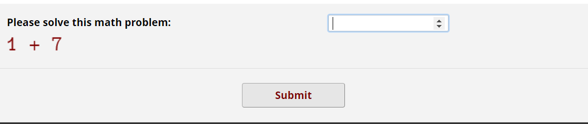
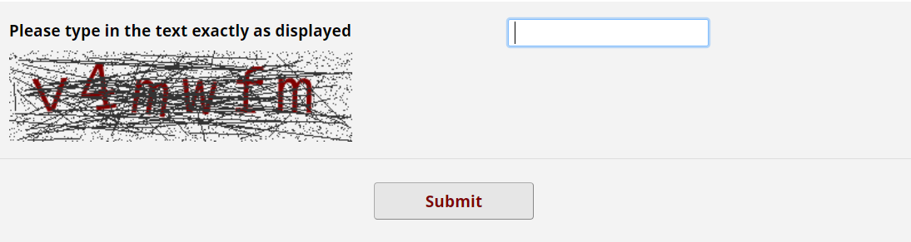
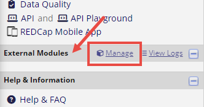
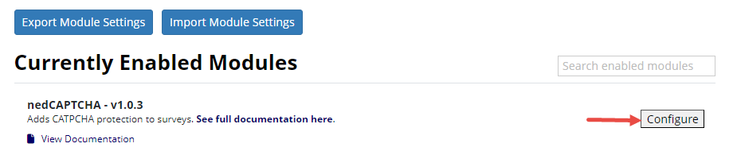
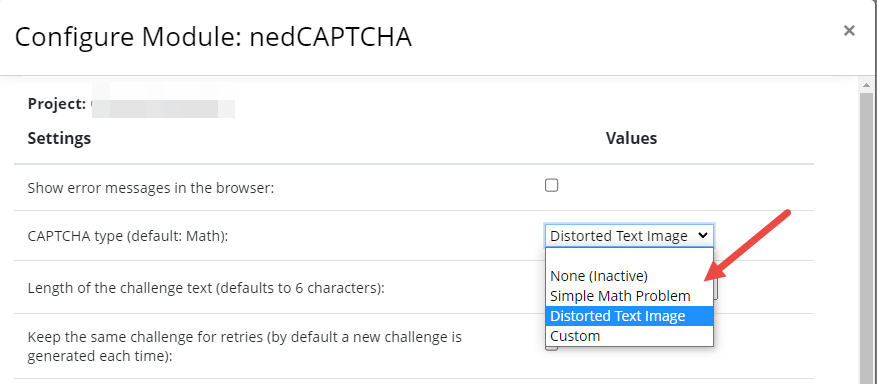
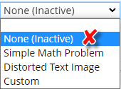

# Prevent spam submissions with a CAPTCHA
{: .no_toc }

## Table of contents
{: .no_toc .text-delta }

1. TOC
{:toc}

## What does a CAPTCHA do?

To protect a public survey from illegitimate attempted by spambots, you may add a [CAPTCHA](https://en.wikipedia.org/wiki/CAPTCHA) to your survey. **nedCAPTCHA** is a REDcap **External Module** that adds CAPTCHA protection to public surveys without any dependencies on external services such as Google (hence the name ned=**n**o **e**xternal **d**ependencies)

## Effect of adding nedCAPTCHA to my survey

When activated in a project, the module will protect the public survey access with a CAPTCHA (either a classic image CAPTCHA with distorted text, a math problem, or a custom challenge). A survey respondent will have to complete the CAPTCHA challenge before being allowed to proceed to the survey. The CAPTCHA has to be completed at most once per user session.

## How to request

All REDcap External Modules including nedCAPTCHA are project-based and need to be requested for individual projects. Request to enable nedCAPTCHA in your project using one of the following methods:

### 1. From within REDCap

On the left menu > Help & Information section > Click **Contact REDCap administrator**

This will open an email template in your email application (e.g. Outlook). The template is prefilled with the essential information about your project. Specify your request as required e.g. add "request to enable the nedCAPTCHA module". The eResearch team (REDCap administrator) will receive and action upon your request.

### 2. Using the request form

Contact eResearch team using the request form https://www.griffith.edu.au/eresearch-services/request-help
- From the "I need help with" option list select "REDCap"
- Provide your details and project information
- Specify your request to enable nedCAPTCHA module in **Request details**.

The eResearch team (REDCap administrator) will receive and action upon your request.

## How to manage nedCAPTCHA

Once activated in your project, nedCAPTCHA can be further customised by project users.

1. One the left menu > External Modules > Click "Manage" to display available modules 

2. Locate the nedCAPTCHA module > Click "Configure" to open module configuration settings

3. Customise the module as required (e.g. select a desired type of CAPTCHA) by changing setting values. 

5. Test the CAPTCHA by opening the survey using the public survey URL (from Survey Distribution Tools)

## Why I can't access the module configuration in REDCap?

You must have the user right of "Project Design and Setup" to access the External Modules page and configure the module. Contact the project owner to acquire the appropriate user right to the project.

## Why the CAPTCHA was skipped in my testing?

First make sure an active type of CAPTCHA is selected in module configuration setting, not the one says "None (inactive)".

The CAPTCHA is only required at most once per user session. If you have tested it once in an internet session, the CAPTCHA will be skipped for the subsequent attempts of accessing the public survey URL within that session. You may start a new session by clearing the browser cache, using a different browser or restarting the browser.
{:. .info }
